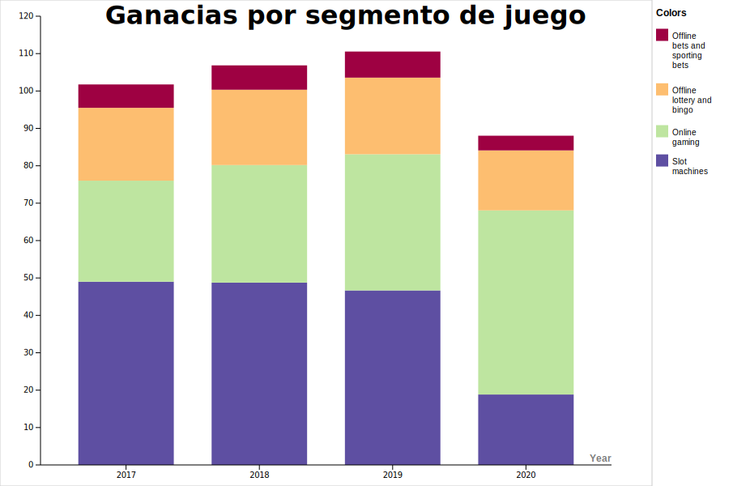

# Stacked Bar Graphs

*El diagrama anterior ha sido realizado usando https://rawgraphs.io/*

## Descripcion

Los diagramas de barras apilados, extienden a los diagramas de barras permitiendo observar valores numéricos agrupados por dos variables categóricas en vez de por una. Cada barra de un diagramá clásico se divide a su vez en un número de sub barras apiladas unas encima de la otra, correspondiendo cada una a uno de los valores de la segunda variable categórica.
De este modo permite representar valores numéricos cuantitativos agrupados por dos tipos de variables categóricas.

## Datos

Para la realización del gráfico se ha elegido el conjunto de datos de las ganacias  de la compañía de apuestas Sisal en Italia por sectores desde el 2017 hasta el 2020. El conjunto de datos utilizado se puede encontrar [aqui](https://www-statista-com.eu1.proxy.openathens.net/statistics/860598/revenues-of-sisal-spa-in-italy/)

El fichero csv con los datos finales usados se encuentra [aqui](./data.csv) 

## Referencias

<https://chartio.com/learn/charts/stacked-bar-chart-complete-guide/#:~:text=The%20stacked%20bar%20chart%20(aka,of%20the%20second%20categorical%20variable>.

https://www.smashingmagazine.com/2017/03/understanding-stacked-bar-charts/

https://www.anychart.com/chartopedia/chart-type/stacked-column-chart/

