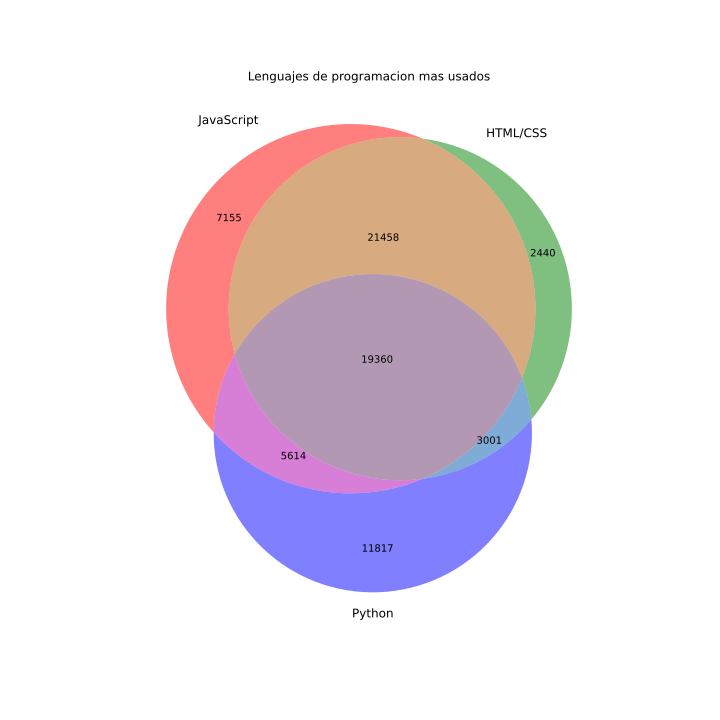

# Venn Diagrams

\*Figura creada usando matplotlib-venn

## Descripcion

Es un tipo de diagrama que permite comparar distintos conjuntos de datos para comprobar cuanto tienen en común. Se lleva usando históricamente en matemáticas para representar las uniones, intersecciones y restas de conjuntos de datos.
Cada conjunto de datos se representa con un círculo normalmente proporcional a numero de elementos que contiene, y donde dos círculos se solapan representa los datos que pertenecen a ambos conjuntos según la categoría que se este evaluando.

## Datos

Para la realización del gráfico se han usado los datos de la [encuesta](https://insights.stackoverflow.com/survey?_ga=2.252873801.1385920275.1649021929-1216731299.1649021929) a los desarrolladores realizada por stackoverflow en 2021 y se han extraido los datos de la pregunta de ¨¿Que lenguajes de programación conoces?".

Se han procesado usando python en un Jupiter notebook que se proporciona [aqui](./venn.ipynb)

## Referencias

https://www.anychart.com/chartopedia/chart-type/venn-diagram/
https://corporatefinanceinstitute.com/resources/knowledge/other/venn-diagram/
https://www.lucidchart.com/pages/tutorial/venn-diagram

https://www.displayr.com/create-a-venn-diagram/
