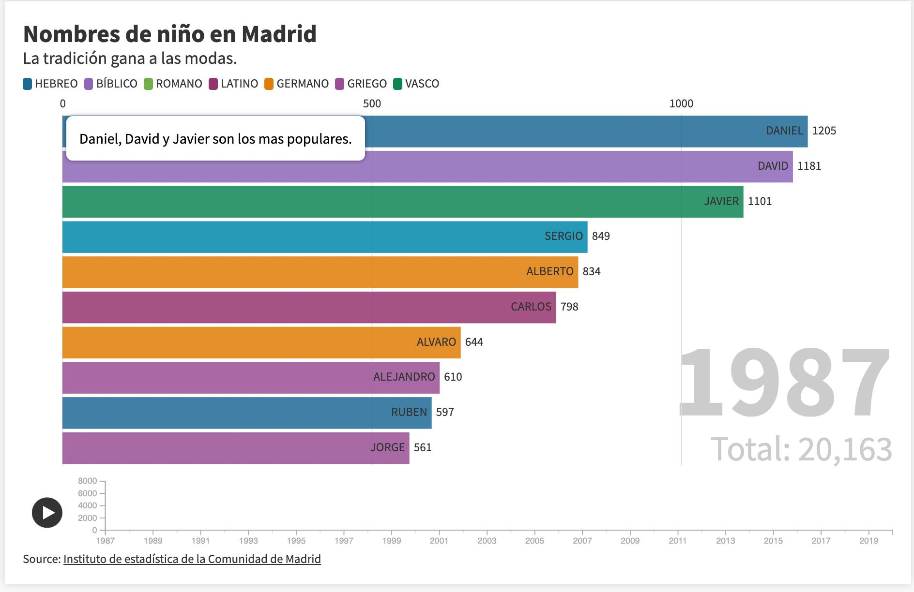

# PEC3 - Story telling

*Visualización creada usando https://flourish.studio/ haz click en la imagen para acceder*

## Descripcion

En ella se muestran los 10 nombres de niños no compuestos más comunes desde 1987 hasta 2020 en la Comunidad de Madrid. Se intenta mostrar que en Madrid prima la tradición y la continuidad en la elección de nombres de bebés por encima de modas puntuales.

Cada año es común escuchar en las noticias o en los periódicos la lista de los nombres mas puestos a los bebés en el último año, quedándose como anécdota anual. Esta visualización intenta aportar un contexto temporal mas amplio a esos datos, respondiendo a las preguntas: ¿se ponen siempre los mismos nombres? ¿Están influenciados por las modas?.

## Datos

Para la realización de la visualización se han usado los datos ]proporcionados por el [instituto de estadística de la comunidad de Madrid](https://www.madrid.org/iestadis/fijas/estructu/demograficas/mnp/estructu_1nac.htm). 
Se han procesado los nombres para eliminar los compuestos y añadir el origen usando un Jupiter notebook que se proporcion [aqui](./nombres.ipynb)

Se proporcionan los juegos de datos usados finalmente en flourish 
- [Niños](./boys.csv) 
- [Niñas](./girls.csv)
