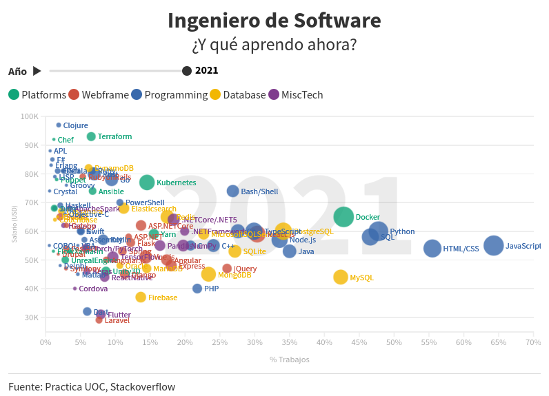

# PRACTICA FINAL

*Visualización creada usando https://flourish.studio/ haz click en la imagen para acceder*

## Descripcion

Partiendo de las encuestas anuales de stackoverflow, se relacionan las tecnologías en las que se ha trabajado con las tecnologias mas populares cada año para ayudar a elegir la proxima tecnología en la que invertir tiempo para maximizar las posibilidades de mejorar las expectativas de sueldo y minimizar la obsolescencia.

## Datos

Para la realización de la visualización se han usado los datos de las encuestas realizadas por stackoverflow y que se pueden descargar [aqui](https://insights.stackoverflow.com/survey)

Debido al tamaño de los archivos no se proporcionan en este repositorio directamente, se deben descargar usando el fichero [data_downloader.ipynb](data/data_downloader.ipynb).
Este fichero tambien descarga los datos de cambio de divisa de cada año de https://openexchangerates.org, para ello se necesita proporcionar una api key.

Una vez descargadas, se han procesado Jupyter Notebook (usando papermill). El código se puede encontrar en el fichero [so_gen.ipynb](so_gen.ipynb)

El juego de datos usado finalmente en Flourish se proporciona en:
- [Datos](data/out/all.csv)

Tambien se proporcionan los datos por cada año individual.
